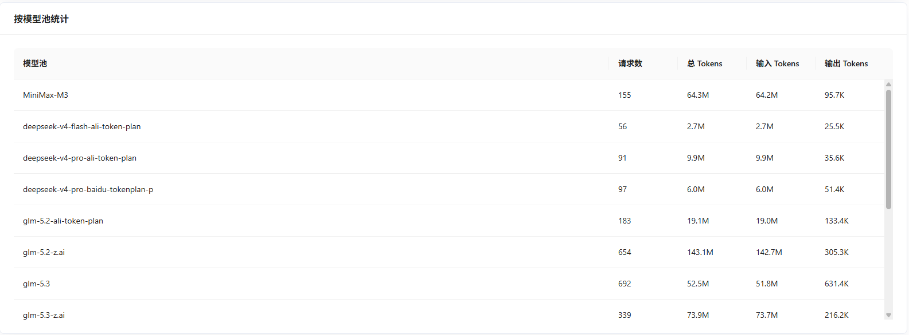
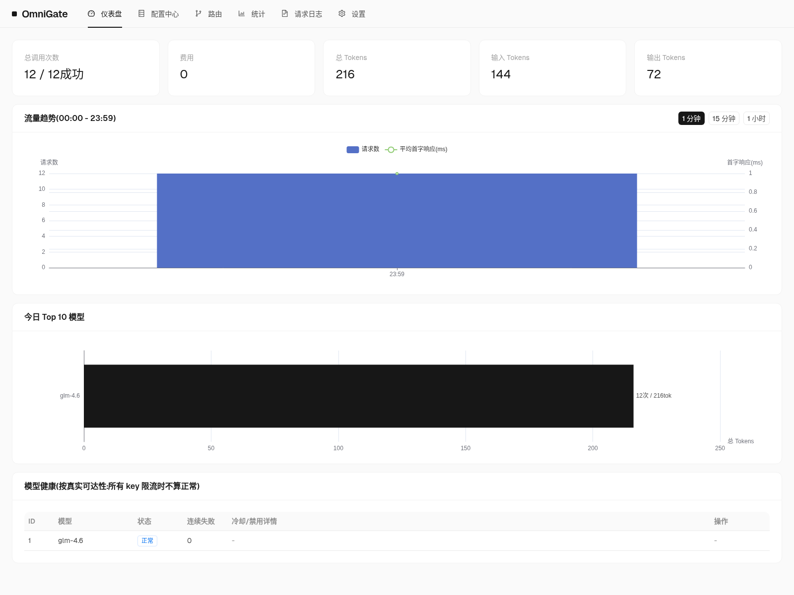
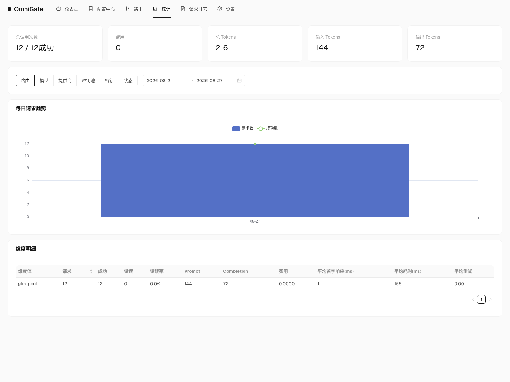

# OmniGate

**OpenAI 兼容的 AI 网关。** 本地优先,单二进制,零外部依赖。

[](https://go.dev)
[](./LICENSE)
[](https://github.com/yunqilee69/OmniGate/releases)
[](#路线图)

OmniGate 把多个模型提供方聚合成一个 OpenAI 兼容端点,提供加权负载均衡、密钥轮询、阶梯熔断和多维统计,内嵌管理控制台——全部打包在一个 34 MB 的静态二进制里。



---

## 特性

| | |
|---|---|
| **OpenAI 兼容代理** | `/v1/chat/completions`(SSE 流式)、`/v1/embeddings`(OpenAI 标准)、`/v1/rerank`(Cohere 骨架直通)、`/v1/models` |
| **混合协议端点** | `/v1/messages`(Anthropic 原生)、`/v1/responses`(OpenAI Responses 原生) — 直通模式,零损耗 |
| **两级路由** | 逻辑模型 → 加权选模型 → 模型内 key 轮询。请求 `glm`,落地到背后任意真实模型 |
| **阶梯熔断** | 模型级 30s → 1m → 3m;key 级 401/403 立即禁用,429 短冷却 |
| **多维统计** | 次数 / token / 首字延迟 / 总耗时 / 费用,按 路由·模型·提供方·key·状态·时间 聚合 |
| **隐私默认** | 只记元数据。请求内容捕获是显式开关(全局 + 按路由两级),默认关闭 |
| **内嵌管理台** | React 18 + Ant Design 5,`go:embed` 嵌入二进制,无独立前端部署 |
| **两层配置** | 启动层(监听地址、账号密码鉴权)走 `config.yaml`;运行层(熔断/捕获/限流等)走 SQLite,管理界面保存即热生效 |
| **单二进制** | 纯 Go SQLite(`modernc.org/sqlite`,无 CGO),一处构建,处处运行 |
| **零配置启动** | 首次运行自动创建 `~/.omnigate/`,落盘 db / config / log 三件套 |

---

## 快速开始

### 安装

```bash
npm install -g @cloudomni/omnigate
```

### 基本命令

```bash
omnigate                   # 后台启动服务（默认）
omnigate start             # 后台启动服务
omnigate stop              # 停止服务
omnigate status            # 查看服务状态
omnigate help              # 显示帮助信息
```

浏览器打开 <http://127.0.0.1:17777> 进入管理台。

> 首次运行会在 `~/.omnigate/` 下自动创建数据目录、初始化 SQLite、生成默认 `config.yaml`、开始记录日志，**完全无需手工准备**。
> 
> **Windows 用户注意**：服务以真正的后台模式运行，关闭 CMD 窗口不影响服务。

### 启动选项

```bash
omnigate start --foreground          # 前台运行（按 Ctrl+C 停止）
omnigate start --listen 0.0.0.0:8080 # 自定义监听地址
omnigate start --db ~/work/og.db     # 覆盖 db 路径（支持 ~ 展开）
omnigate start --log stdout          # 仅输出到 stdout
omnigate start --config ~/my.yaml    # 指定配置文件
```

### 数据布局

```
~/.omnigate/
├── omnigate.db           # SQLite(实体、运行层配置、请求日志、可选内容日志)
├── omnigate.db-wal       # SQLite WAL(写入中,正常关闭后会被清理)
├── omnigate.db-shm       # SQLite 共享内存
├── omnigate.pid          # 后台进程 PID 文件
├── config.yaml           # 启动层:监听地址 / 账号密码 / api_key(自动生成,含注释)
└── omnigate.log          # 结构化日志(slog,stderr 同写)
```

### 卸载

```bash
omnigate stop             # 先停止服务
npm uninstall -g @cloudomni/omnigate
rm -rf ~/.omnigate        # 数据一并清理(可选)
```

---

## 架构

```
客户端(任意 OpenAI SDK)
       │  POST /v1/chat/completions  model="glm"
       ▼
┌────────────────────────── OmniGate(单进程) ──────────────────────────┐
│                                                                       │
│  代理面                    核心引擎                  管理面             │
│  ┌────────────┐   ┌──────────────────────────┐   ┌─────────────────┐  │
│  │ /v1/chat/  │──▶│ 解析逻辑 modelId          │   │  REST API       │  │
│  │ completions│   │ → 加权选模型目标          │   │  实体 CRUD / 统计│  │
│  │ /v1/models │   │ → key 轮询(按模型)        │   └─────────┬───────┘  │
│  └────────────┘   │ → 熔断态 key 跳过         │             │ 写库+事件 │
│        │          │ → 转发 + SSE 透传         │             ▼           │
│        ▼          │ → 失败转移重试            │   ┌─────────────────┐   │
│  ┌────────────┐   └──────────┬───────────────┘   │ 配置快照        │   │
│  │  统计埋点  │◀─────────────┘                   │ (atomic.Pointer)│   │
│  └─────┬──────┘                                  └─────────────────┘   │
│        ▼                                            ▲                  │
│  ┌────────────────────────────────────┐             │                  │
│  │ SQLite(纯 Go,无 CGO)               │◀── 熔断(模型级 + key 级)          │
│  │ 实体 / 配置 / 请求日志 / (可选内容)│                                   │
│  └────────────────────────────────────┘                                   │
│  管理台 UI(React + AntD,go:embed)                                       │
└───────────────────────────────────────────────────────────────────────────┘
       │                                │
       ▼                                ▼
  提供方 A(智谱)                提供方 B(任意 OpenAI 兼容)
  ├─ 密钥 [k1..kN]               ├─ 密钥 [k1..kM]
  └─ ...                         └─ ...
```

完整设计见 [`docs/design.md`](./docs/design.md)(实体模型、熔断状态机、重试策略、Schema、里程碑)。

### 混合协议方案

OmniGate 提供三种协议端点，满足不同使用场景：

| 端点 | 协议 | 使用场景 | 特点 |
|---|---|---|---|
| **`/v1/chat/completions`** | OpenAI | **推荐：日常使用** | 统一接口，自动转换，可路由到任意协议的模型 |
| **`/v1/messages`** | Anthropic | 需要 `thinking` 等特性 | 直通模式，保留厂商独有参数，仅路由到 `protocol=anthropic` 的模型 |
| **`/v1/responses`** | OpenAI Responses | 需要 `reasoning_content` | 直通模式，保留推理过程，仅路由到 `protocol=responses` 的模型 |

**推荐用法**：
- **80% 场景**：使用 `/v1/chat/completions` — 简单、统一、负载均衡灵活
- **特殊需求**：需要厂商独有参数时，使用原生端点 — 零损耗、参数完整

**示例**：
```bash
# 标准 OpenAI 格式（推荐）- 可路由到任意协议的模型
curl http://localhost:17777/v1/chat/completions \
  -H "Content-Type: application/json" \
  -d '{"model": "claude", "messages": [{"role": "user", "content": "Hi"}]}'

# Anthropic 原生格式 - 仅路由到 protocol=anthropic 的模型
curl http://localhost:17777/v1/messages \
  -H "Content-Type: application/json" \
  -d '{"model": "claude", "messages": [{"role": "user", "content": "Hi"}], "thinking": {"type": "enabled"}}'
```

> **协议转换详情**: 完整的字段映射、已知限制和最佳实践见 [`docs/protocol-conversion.md`](./docs/protocol-conversion.md)。

---

## 截图

| 仪表盘 | 统计 |
|---|---|
|  |  |

---

## 配置:两层分离

**启动层** — `config.yaml`,进程启动时读取。决定"进程怎么起来"。

```yaml
server:
  listen: 127.0.0.1:17777   # 局域网访问改成 0.0.0.0
admin:
  username: ""              # 登录账号: 设置后 Web 管理台需登录
  password: ""              # 账号密码本身也可调 /v1 (Basic base64 编码)
  api_key: ""               # /v1 专用网关密钥; 仅设此项 = 本地免登录+远程带密钥
```

**运行层** — 管理界面改、SQLite 存、`atomic.Pointer` 快照无锁热替换。

| 配置项 | 默认 | 说明 |
|---|---|---|
| 模型熔断 | 开启 | 30s → 1m → 3m 阶梯退避 |
| key 熔断 | 开启 | 401/403 立即禁用,429 短冷却 |
| 请求内容捕获 | **关闭** | 全局 + 按路由两级开关;元数据始终记录 |
| 日志保留期 | 0（永久） | >0 时每小时自动清理；管理台"危险操作"支持手动清理与清空统计 |
| Token / 费用定价 | 按模型 | 价格随模型元数据持久化，支持 $/¥ 双币种定价与展示切换 |

启动层和运行层刻意分开:改 `config.yaml` 要重启;在 UI 调熔断/捕获/限流对下一个请求立即生效,无需重启。

---

## 开发

前置:Go 1.22+、Node 18+(仅 web 构建需要)。

```bash
git clone https://github.com/yunqilee69/OmniGate
cd omnigate

./start.sh             # 开发模式:后端 :17777 + Vite 热更新 :17778
./start.sh --prod      # 生产模式:后端 + 内嵌前端 :17777
```

只编后端:

```bash
go build -o omnigate ./cmd/omnigate
```

只编前端(产物落到 `internal/webui/dist/`,由 Go 嵌入):

```bash
cd web && npm ci && npm run build
```

跑测试:

```bash
go test ./...
```

---

## 目录结构

```
.
├── cmd/omnigate/             # 入口(flag 解析、信号处理、装配)
├── internal/
│   ├── api/                  # 管理 REST + /v1/* 代理 handler
│   ├── breaker/              # 模型级 + key 级状态机
│   ├── config/               # 启动层(YAML) + 运行层(SQLite 快照)
│   ├── proxy/                # 转发、SSE 透传、重试策略
│   ├── router/               # 三级选择算法
│   ├── store/                # GORM 模型、迁移
│   └── webui/                # 内嵌 React 产物(go:embed)
├── web/                      # React + Ant Design 源码
├── docs/
│   ├── design.md             # 设计文档(实体、熔断、Schema)
│   ├── RELEASE.md            # 发布与分发流程
│   └── images/               # README 配图
├── .goreleaser.yaml
└── .github/workflows/        # CI + 发布
```

---

## 与同类项目对比

| | OmniGate | one-api / new-api | OpenRouter | LiteLLM |
|---|---|---|---|---|
| **运行时** | Go 单二进制 | Go 二进制 | 托管 SaaS | Python 服务 |
| **存储** | SQLite(单文件) | SQLite / MySQL / PG | 云端 | 配置文件 |
| **协议** | MIT | AGPL-3.0 | 专有 | MIT |
| **自部署** | ✅ 丢上去就跑 | ✅ | ❌ | ✅ |
| **管理 UI** | 内嵌 | 独立前端 | 云端 | 无 |
| **MCP 网关** | 规划中 | ❌ | ❌ | ❌ |

`one-api` / `new-api` 仅作**行为参考,零行拷贝**——详见 `docs/design.md` §11 的协议合规说明。

---

## 路线图

- [x] **v1.0** — 设计定稿(实体模型、路由、熔断、统计、UI)
- [ ] **v1.1** — MCP(Model Context Protocol)网关
- [ ] **v1.2** — Anthropic / Gemini 原生协议适配
- [ ] **v1.3** — Token 用量预算与软配额
- [ ] **v2.0** — 多实例集群模式(读写分离、配置共享)

实时待办见 [issues](https://github.com/yunqilee69/OmniGate/issues)。

---

## 技术栈

| 层 | 选型 | 理由 |
|---|---|---|
| 语言 | Go 1.22+ | 单静态二进制、低内存、冷启动快 |
| HTTP | `net/http` + `chi` | 标准库够用;chi 中间件顺手 |
| ORM / 存储 | GORM + `modernc.org/sqlite` | 纯 Go 无 CGO,交叉编译零摩擦 |
| 热更新 | `atomic.Pointer[Snapshot]` | 读路径无锁,进行中请求不受影响 |
| SDK 复用 | `anthropic-sdk-go`(MIT)+ `sashabaranov/go-openai`(Apache-2.0) | 直接复用 wire/SSE 类型 |
| UI | React 18 + Ant Design 5 + ECharts | `go:embed` 内嵌 |
| 日志 | `log/slog`(结构化) | 标准库 |

---

## 贡献

欢迎 PR。两条约定:

1. **`go test ./...` 必须通过**才进 review。新逻辑带表驱动单测。
2. **`internal/webui/dist/` 不要进特性 commit**——它由 `npm run build` 重新生成。push 前 `git status` 检查,如有改动 revert。

较大改动先开 issue 讨论,PR 关联 issue 号。

---

## 协议

[MIT](./LICENSE) — Copyright (c) 2026 CloudOmni。

---

## 致谢

设计参考:[`one-api`](https://github.com/songquanpeng/one-api)(MIT)、[`Bifrost`](https://github.com/maximhq/bifrost)(MIT)、[`BricksLLM`](https://github.com/bricks-cloud/bricksllm)(Apache-2.0)。协议类型适配自 [`anthropic-sdk-go`](https://github.com/anthropics/anthropic-sdk-go) 与 [`sashabaranov/go-openai`](https://github.com/sashabaranov/go-openai)。
