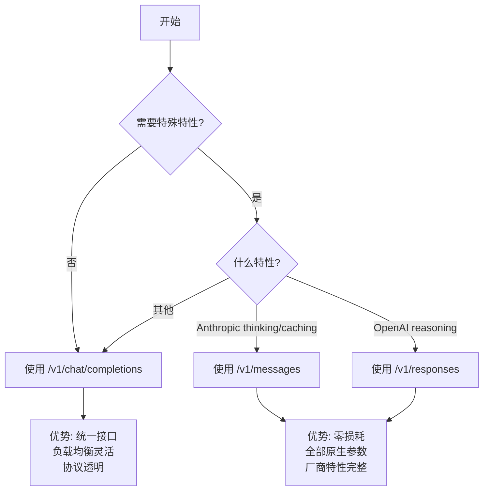

# 协议转换参考

OmniGate 支持三种 LLM 协议的自动转换，使客户端能够使用统一的 OpenAI 格式访问任意后端模型。本文档详细说明转换机制、字段映射和已知限制。

---

## 转换架构

### 核心原则

OmniGate 采用 **OpenAI 作为统一接口格式**，通过协议适配器实现双向转换：

```
客户端 OpenAI 请求
  ↓
[入站转换] OpenAI → 目标协议 (openai/anthropic/responses)
  ↓
上游返回目标协议响应
  ↓
[出站转换] 目标协议 → OpenAI
  ↓
客户端收到 OpenAI 响应
```

### 端点策略

| 端点 | 输入格式 | 输出格式 | 协议过滤 | 转换模式 |
|------|---------|---------|---------|---------|
| **`/v1/chat/completions`** | OpenAI | OpenAI | `type=chat` (不限 protocol) | **双向转换** |
| **`/v1/messages`** | Anthropic | Anthropic | `protocol=anthropic` | **直通透传** |
| **`/v1/responses`** | OpenAI Responses | OpenAI Responses | `protocol=responses` | **直通透传** |
| `/v1/embeddings` | OpenAI | OpenAI | `type=embedding` | 直通(仅改 model) |
| `/v1/rerank` | Cohere | Cohere | `type=rerank` | 直通(仅改 model) |
| `/v1/images/generations` | OpenAI Images | OpenAI | `type=image` | 直通(仅改 model；`stream` 原样透传) |
| `/v1/audio/speech` | OpenAI TTS | 音频/SSE | `type=tts` | 直通(仅改 model；二进制或 SSE 流式透传) |
| `/v1/audio/transcriptions` | OpenAI STT multipart | JSON/文本 | `type=stt` | 直通(仅改 model；入站全缓冲) |
| `/v1/videos` | OpenAI Videos（Sora 格式） | 任务对象 JSON | `type=video` | 直通(仅改 model；**异步任务**，见下) |
| `/v1/videos/{id}` | — | 任务对象 JSON | 按 `video_task` 映射 | 回查透传(不产生新调用记录) |
| `/v1/videos/{id}/content` | — | 视频字节流 | 按 `video_task` 映射 | 回查透传(流式) |

---

## OpenAI ↔ Anthropic 转换

### 支持的功能

| 功能 | OpenAI → Anthropic | Anthropic → OpenAI | 备注 |
|------|-------------------|-------------------|------|
| 基础对话 | ✅ | ✅ | |
| 流式响应 | ✅ | ✅ | SSE 事件格式转换 |
| System 消息 | ✅ | ✅ | 提取到 `system` 字段 |
| 图像输入 | ✅ | ✅ | base64 编码转换 |
| 工具调用 | ✅ | ✅ | `tool_calls` ↔ `tool_use` |
| 工具结果 | ✅ | ✅ | `role=tool` → `tool_result` 块 |
| Usage 统计 | ✅ | ✅ | token 计数映射 |

### 请求字段映射 (OpenAI → Anthropic)

#### 顶层字段

| OpenAI | Anthropic | 转换规则 |
|--------|-----------|---------|
| `model` | `model` | 直接映射，替换为真实模型名 |
| `messages` | `messages` + `system` | `role=system` 提取到顶层 `system` 字段 |
| `max_tokens` | `max_tokens` | 直接映射，缺省时补 4096 |
| `temperature` | `temperature` | 直接映射 |
| `top_p` | `top_p` | 直接映射 |
| `stream` | `stream` | 直接映射 |
| `tools` | `tools` | 函数签名转换(见下) |
| `tool_choice` | `tool_choice` | `{type, function}` → `{type, name}` |
| `top_k` | `top_k` | 直接映射(OpenAI 原生不支持) |

#### 消息转换

**普通文本消息**:
```json
// OpenAI
{"role": "user", "content": "Hello"}

// Anthropic
{"role": "user", "content": [{"type": "text", "text": "Hello"}]}
```

**System 消息**:
```json
// OpenAI (在 messages 数组中)
{"role": "system", "content": "You are a helpful assistant"}

// Anthropic (提取到顶层)
{
  "system": "You are a helpful assistant",
  "messages": [...]
}
```

**图像消息**:
```json
// OpenAI
{
  "role": "user",
  "content": [
    {"type": "text", "text": "What's in this image?"},
    {"type": "image_url", "image_url": {"url": "data:image/jpeg;base64,..."}}
  ]
}

// Anthropic
{
  "role": "user",
  "content": [
    {"type": "text", "text": "What's in this image?"},
    {
      "type": "image",
      "source": {
        "type": "base64",
        "media_type": "image/jpeg",
        "data": "..."
      }
    }
  ]
}
```

**工具调用消息**:
```json
// OpenAI
{
  "role": "assistant",
  "content": "Let me check the weather",
  "tool_calls": [{
    "id": "call_abc",
    "type": "function",
    "function": {"name": "get_weather", "arguments": "{\"city\":\"SF\"}"}
  }]
}

// Anthropic
{
  "role": "assistant",
  "content": [
    {"type": "text", "text": "Let me check the weather"},
    {
      "type": "tool_use",
      "id": "call_abc",
      "name": "get_weather",
      "input": {"city": "SF"}
    }
  ]
}
```

**工具结果消息**:
```json
// OpenAI
{
  "role": "tool",
  "tool_call_id": "call_abc",
  "content": "Sunny, 72°F"
}

// Anthropic
{
  "role": "user",
  "content": [{
    "type": "tool_result",
    "tool_use_id": "call_abc",
    "content": "Sunny, 72°F"
  }]
}
```

#### 工具定义转换

```json
// OpenAI
{
  "type": "function",
  "function": {
    "name": "get_weather",
    "description": "Get weather for a location",
    "parameters": {
      "type": "object",
      "properties": {
        "location": {"type": "string"}
      },
      "required": ["location"]
    }
  }
}

// Anthropic
{
  "name": "get_weather",
  "description": "Get weather for a location",
  "input_schema": {
    "type": "object",
    "properties": {
      "location": {"type": "string"}
    },
    "required": ["location"]
  }
}
```

#### Tool Choice 转换

| OpenAI `tool_choice` | Anthropic `tool_choice` |
|---------------------|------------------------|
| `"none"` | (不发送 tools 字段) |
| `"auto"` | `{"type": "auto"}` |
| `"required"` / `"any"` | `{"type": "any"}` |
| `{"type": "function", "function": {"name": "X"}}` | `{"type": "tool", "name": "X"}` |

### 响应字段映射 (Anthropic → OpenAI)

#### 非流式响应

```json
// Anthropic
{
  "id": "msg_01ABC",
  "type": "message",
  "role": "assistant",
  "content": [
    {"type": "text", "text": "Hello!"}
  ],
  "model": "claude-3-5-sonnet-20241022",
  "stop_reason": "end_turn",
  "usage": {
    "input_tokens": 10,
    "output_tokens": 5
  }
}

// OpenAI
{
  "id": "chatcmpl-01ABC",
  "object": "chat.completion",
  "model": "claude-3-5-sonnet-20241022",
  "choices": [{
    "index": 0,
    "message": {
      "role": "assistant",
      "content": "Hello!"
    },
    "finish_reason": "stop"
  }],
  "usage": {
    "prompt_tokens": 10,
    "completion_tokens": 5,
    "total_tokens": 15
  }
}
```

#### Finish Reason 映射

| Anthropic `stop_reason` | OpenAI `finish_reason` |
|------------------------|----------------------|
| `end_turn` | `stop` |
| `stop_sequence` | `stop` |
| `max_tokens` | `length` |
| `tool_use` | `tool_calls` |

#### 流式响应事件转换

**消息开始**:
```json
// Anthropic
{"type": "message_start", "message": {...}}

// OpenAI (内部记录，不发送给客户端)
```

**内容块开始**:
```json
// Anthropic
{"type": "content_block_start", "index": 0, "content_block": {"type": "text", "text": ""}}

// OpenAI
{
  "id": "chatcmpl-...",
  "object": "chat.completion.chunk",
  "choices": [{
    "index": 0,
    "delta": {"role": "assistant", "content": ""},
    "finish_reason": null
  }]
}
```

**内容增量**:
```json
// Anthropic
{"type": "content_block_delta", "index": 0, "delta": {"type": "text_delta", "text": "Hello"}}

// OpenAI
{
  "choices": [{
    "index": 0,
    "delta": {"content": "Hello"},
    "finish_reason": null
  }]
}
```

**工具调用流**:
```json
// Anthropic (开始)
{"type": "content_block_start", "content_block": {"type": "tool_use", "id": "call_abc", "name": "get_weather"}}

// OpenAI
{
  "choices": [{
    "delta": {
      "tool_calls": [{
        "index": 0,
        "id": "call_abc",
        "type": "function",
        "function": {"name": "get_weather", "arguments": ""}
      }]
    }
  }]
}

// Anthropic (参数增量)
{"type": "content_block_delta", "delta": {"type": "input_json_delta", "partial_json": "{\"city\""}}

// OpenAI
{
  "choices": [{
    "delta": {
      "tool_calls": [{"index": 0, "function": {"arguments": "{\"city\""}}]
    }
  }]
}
```

**消息结束**:
```json
// Anthropic
{"type": "message_delta", "delta": {"stop_reason": "end_turn"}, "usage": {...}}

// OpenAI
{
  "choices": [{
    "delta": {},
    "finish_reason": "stop"
  }]
}
```

### 已知限制

| 特性 | 限制说明 | 解决方案 |
|------|---------|---------|
| **Thinking** | OpenAI 格式不支持 `thinking` 参数和响应字段 | 使用 `/v1/messages` 原生端点 |
| **Prompt Caching** | 无法通过 OpenAI 格式传递缓存控制参数 | 使用 `/v1/messages` 原生端点 |
| **PDF 输入** | Anthropic 支持 PDF 文档块，OpenAI 格式无对应字段 | 不转换,丢弃 PDF 块 |
| **多 System 消息** | Anthropic 只支持单个 system 字段 | 合并多条 system 消息 |
| **消息顺序** | OpenAI 允许连续的 assistant 消息，Anthropic 不允许 | 自动合并连续同角色消息 |

---

## OpenAI ↔ OpenAI Responses 转换

### 支持的功能

| 功能 | OpenAI → Responses | Responses → OpenAI | 备注 |
|------|-------------------|-------------------|------|
| 基础对话 | ✅ | ✅ | |
| 流式响应 | ✅ | ✅ | |
| 工具调用 | ✅ | ✅ | `tool_calls` ↔ `function_call` |
| 推理过程 | ❌ | ✅ | `reasoning_content` 转为 `content` |

### 请求字段映射 (OpenAI → Responses)

#### 消息转换

```json
// OpenAI messages
[
  {"role": "system", "content": "You are helpful"},
  {"role": "user", "content": "Hi"},
  {"role": "assistant", "content": "Hello", "tool_calls": [...]},
  {"role": "tool", "tool_call_id": "call_abc", "content": "result"}
]

// Responses input
[
  {"type": "message", "role": "system", "content": "You are helpful"},
  {"type": "message", "role": "user", "content": "Hi"},
  {
    "type": "function_call",
    "call_id": "call_abc",
    "name": "function_name",
    "arguments": "{...}"
  },
  {
    "type": "function_call_output",
    "call_id": "call_abc",
    "output": "result"
  }
]
```

#### 工具定义转换

```json
// OpenAI
{
  "type": "function",
  "function": {
    "name": "get_weather",
    "description": "...",
    "parameters": {...}
  }
}

// Responses
{
  "type": "function",
  "name": "get_weather",
  "description": "...",
  "parameters": {...}
}
```

### 响应字段映射 (Responses → OpenAI)

#### 非流式响应

```json
// Responses
{
  "id": "resp_abc",
  "model": "gpt-4o",
  "status": "completed",
  "output_text": "Hello!",
  "output": [
    {"type": "message", "content": [{"type": "output_text", "text": "Hello!"}]}
  ],
  "usage": {
    "input_tokens": 10,
    "output_tokens": 5
  }
}

// OpenAI
{
  "id": "chatcmpl-abc",
  "object": "chat.completion",
  "model": "gpt-4o",
  "choices": [{
    "index": 0,
    "message": {
      "role": "assistant",
      "content": "Hello!"
    },
    "finish_reason": "stop"
  }],
  "usage": {
    "prompt_tokens": 10,
    "completion_tokens": 5,
    "total_tokens": 15
  }
}
```

#### Status 映射

| Responses `status` | OpenAI `finish_reason` |
|-------------------|----------------------|
| `completed` | `stop` |
| `incomplete` | `length` |
| `failed` | (返回错误响应) |

### 已知限制

| 特性 | 限制说明 | 解决方案 |
|------|---------|---------|
| **Reasoning Content** | OpenAI 格式不保留 `reasoning_content` 字段 | 使用 `/v1/responses` 原生端点 |
| **推理过程** | 转换后丢失模型内部推理步骤 | 使用 `/v1/responses` 原生端点 |

---

## 视频生成（异步任务族）

`type=video` 模型挂 `/v1/videos`，是网关里唯一的异步端点族。上游格式无跨厂商标准
（OpenAI Sora 用 `/videos`、Runway 用 `/image_to_video`，参数集互不兼容），因此与
images/tts/stt 同方针：**请求体直通，仅重写 `model` 字段**，不做跨厂商转换。

### 三步流程

```
① POST /v1/videos          {"model":"<路由>","prompt":"...","size":"1280x720","seconds":"8"}
     └ 路由选择(type=video) → 密钥轮询 → 直通上游 → 原样回写任务对象 {id, status:"queued", ...}
     └ 响应含 id 时登记 video_task（id → 提供商×模型×密钥），提交本身按 per_call 计费落 request_log

② GET /v1/videos/{id}      轮询直到 status=completed/failed
     └ 查 video_task 定位上游与当初命中的密钥 → 原样透传 JSON（不落新日志）

③ GET /v1/videos/{id}/content   下载成片
     └ 同上，透传 Content-Type/Content-Length 与字节流
```

### 设计约束

- **只认自己登记过的任务**：`video_task` 未命中的 id 一律 404。否则任意 id 都会被
  带上提供商密钥转发，网关退化为开放代理。
- **回查不走路由/熔断**：任务必须回到创建它的上游（渲染产物存在那里），因此按
  `video_task` 的落点直连，而非重新做加权选择；也不产生 `request_log`（费用已在
  提交时结算，轮询是客户端行为，不该刷统计）。
- **计费**：推荐 `billing_mode=per_call`（提交成功即计一次）。上游回显 `seconds`
  （Sora 为字符串 `"8"`，也有厂商写数字）时记入 `audio_seconds`，可配
  `audio_second` 按秒计费。
- **保留期**：`video_task` 跟随 `log_retention_days` 清理；映射被清后旧 id 回查 404。
- **模型上游要求**：`base_url` 需为暴露 `/videos` 族的端点（如
  `https://api.openai.com/v1`）。`body_override` 可改提交体字段；提交与回查路径均按
  `baseURL + /videos` / `/videos/{id}` 拼接，网关不按 `api_path` 改写（typed 端点族同此约定）。路径不兼容时只能由客户端直连上游轮询。

---

## 使用建议

### 选择合适的端点



### 最佳实践

1. **默认使用 `/v1/chat/completions`**
   - 80% 的场景不需要厂商特性
   - 代码统一,易于切换提供商
   - 自动负载均衡和容错

2. **原生端点用于特殊需求**
   - Anthropic thinking/extended_thinking
   - Anthropic prompt caching
   - OpenAI reasoning_content

3. **工具调用推荐主端点**
   - 转换层完整支持工具调用
   - 可以在 OpenAI/Anthropic/Responses 间无缝切换
   - 注意复杂工具定义可能有边界情况

4. **流式响应注意事项**
   - 转换后的 SSE 格式符合 OpenAI 规范
   - TTFT(首字节延迟)统计准确
   - 流中断会触发重试(如果配置允许)

### 验证转换正确性

在生产环境使用前,建议:

1. **对比测试**: 同时调用原生端点和转换端点,对比响应差异
2. **边界用例**: 测试多轮对话、工具调用、图像输入等复杂场景
3. **错误处理**: 验证上游错误能正确透传
4. **性能基准**: 转换层开销 <1ms,不影响 TTFT

---

## 参考实现

- **适配器代码**: `internal/proxy/adapter.go`
- **转换测试**: `internal/proxy/adapter_test.go`
- **OpenAI 格式**: [OpenAI API Reference](https://platform.openai.com/docs/api-reference/chat)
- **Anthropic 格式**: [Anthropic Messages API](https://docs.anthropic.com/en/api/messages)
- **Responses 格式**: [OpenAI Responses API](https://platform.openai.com/docs/api-reference/responses)

---

## 行业对比

OmniGate 的协议转换方案与主流 AI 网关保持一致:

| 项目 | 转换策略 | 混合端点 | 文档完善度 |
|------|---------|---------|-----------|
| **OmniGate** | 双向完整 | ✅ 3个端点 | ✅ 本文档 |
| **LiteLLM** | 适配器模式 | ✅ Pass-through | ✅ 官方文档 |
| **API7 Gateway** | 双向完整 | ✅ URI识别 | ✅ 字段映射表 |
| **one-api** | 双向完整 | ❌ 单端点 | ⚠️ 代码注释 |

---

## 反馈与改进

如果遇到转换问题:

1. **检查日志**: 开启 `debug_stream_log` 查看原始请求/响应
2. **查看尝试日志**: `request_attempt` 表记录每次转发细节
3. **提交 Issue**: 附带请求体(脱敏)和错误信息
4. **降级方案**: 使用原生端点绕过转换层
